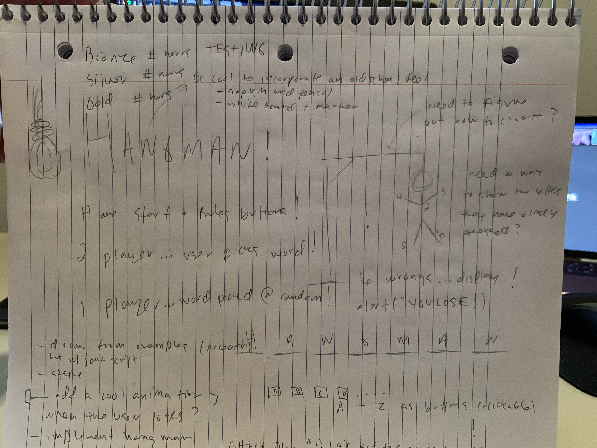
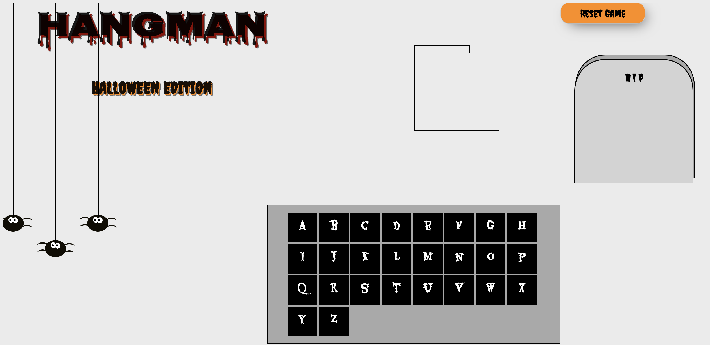

# Hangman

A simple Halloween themed hangman game made through DOM manipulatin with HTML5, CSS3, and JavaScript. 

# Wireframe

# Technical Requirements
## Game must: 
- Render in the browser
- Include separate HTML / CSS / JavaScript files
- Use Javascript for DOM manipulation
- Be deployed online, using Github Project pages and/or to a custom domain.
- Use semantic markup for HTML and CSS (adhere to best practices)
- Show a good commit history with frequent commits

Additionally, your project should stick with KISS (Keep It Stupid Simple) and DRY (Don't Repeat Yourself) principles.

# Technology Used

- **Command Line:** used to interact with computer, to create and move files used with hangman-abenck17.github.io
- **Visual Studio Code:** used to build code with HTML, CSS, and JavaScript
- **Google Chrome:** used for launching website, and researching tips and tricks for Hangman project
- **Google Chrome Dev Tools:** used to debug code when running into problems, and to help visualize where code would show up in browser
- **Netlify:** used for deployment
- **CodePen:** used to sample code segments, and test different sceneraios on code

# Requires 

1-2 Players

# Game play 

A Halloween themed word will be selected at random, and the user takes turns guessing letters from that word. The user has 7 lives or seven wrongs to guess what the random word is. If the user guesses a letter right, then that letter will show up where it is displayed in the random word. If the user guesses a letter wrong, then the user will lose one life and will populate one piece of the "Hangman". 

# Objective 

Guess the Halloween themed word before you run out of lives and the skeleton **GETS HUNG!**. 

# Run in Netlify
[Depolyed game](https://heuristic-johnson-b7906c.netlify.app/)

